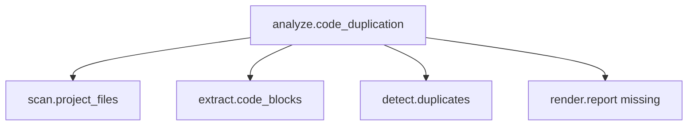

Poniżej masz plan dalszego developmentu **Intract** jako rozwiązania typu **intent contract layer** — czyli systemu kontraktów intencji dla kodu, komentarzy i `intent.yaml`.

Aktualny MVP masz już jako paczkę ZIP: [intract-python-package.zip](sandbox:/mnt/data/intract-python-package.zip)

# 1. Kierunek produktu

**Intract** powinien rozwijać się nie jako pełny język programowania, tylko jako:

```text
warstwa kontraktów intencji dla kodu
```

Czyli projekt ma pozwalać na:

```text
1. Oznaczanie intencji w komentarzach.
2. Oznaczanie wielu plików naraz przez intent.yaml.
3. Łączenie intencji w graf zależności.
4. Walidowanie, czy kod spełnia zadeklarowane intencje.
5. Wykrywanie braków, naruszeń i duplikacji intencji.
6. Integrację z reDUP jako dodatkowa warstwa analizy.
```

Docelowo:

```bash
intract scan .
intract validate .
intract graph .
intract duplicates .
intract coverage .
intract export --format sarif
```

---

# 2. Roadmap wersji

## `0.1.x` — stabilizacja MVP

Cel: doprowadzić obecną paczkę do stanu, w którym jest stabilna, testowalna i gotowa do dalszego rozwoju.

Zakres:

```text
- poprawki parsera @intract.v1,
- stabilizacja CLI,
- pełniejsze testy,
- dokumentacja startowa,
- przykłady dla Python / TypeScript / C#,
- dopracowanie intent.yaml,
- podstawowa walidacja input/output/forbid/return.
```

Komendy docelowe:

```bash
intract scan .
intract validate .
intract init .
```

Kryterium ukończenia:

```bash
pytest -q
ruff check .
python -m intract scan examples
python -m intract validate examples
```

---

## `0.2.x` — formalizacja kontraktu

Cel: zamienić obecny format w formalny, wersjonowany standard.

Do zrobienia:

```text
1. Oficjalna specyfikacja @intract.v1.
2. JSON Schema dla intent.yaml / intract.yaml.
3. Obsługa błędów parsera z numerami linii.
4. Walidacja manifestu przed analizą.
5. Tryb strict i relaxed.
6. Obsługa aliasów pól.
7. Obsługa komentarzy wieloliniowych.
```

Przykład:

```yaml
version: intract.v1

contracts:
  - id: project.analysis
    scope: project
    intent: analyze:code_duplication
    require:
      - scan.project_files
      - extract.code_blocks
      - detect.duplicates
```

Nowe komendy:

```bash
intract check-manifest intent.yaml
intract spec
intract explain @intract.v1
```

Kryterium ukończenia:

```text
- błędny intent.yaml zwraca czytelne błędy,
- każda reguła ma opis w docs,
- parser rozróżnia error / warning / unknown field.
```

---

## `0.3.x` — silnik walidacji reguł

Cel: obecny validator regexowy zamienić w rozszerzalny system reguł.

Obecnie walidacja jest prosta:

```text
input_presence
output_presence
return_value
no_forbidden_effect
```

Docelowo trzeba zrobić rejestr reguł:

```python
class ValidationRule:
    name: str

    def validate(self, contract, source, context) -> RuleResult:
        ...
```

Reguły do dodania:

```text
input_presence
output_presence
return_value
no_forbidden_effect
effect_match
required_intents
name_match
call_match
import_match
type_hint_match
docstring_match
test_presence
coverage_presence
```

Nowa struktura:

```text
src/intract/rules/
  __init__.py
  base.py
  input_output.py
  effects.py
  requirements.py
  naming.py
  imports.py
  calls.py
```

Kryterium ukończenia:

```text
- każda reguła działa jako plugin,
- można dodać własną regułę bez zmiany core,
- raport pokazuje, która reguła przeszła, a która nie.
```

---

## `0.4.x` — wieloplikowy graf intencji

To jest najważniejszy etap dla Twojej wizji.

Cel: Intract ma łączyć wiele plików i wiele kontraktów w graf semantyczny.

Przykład:

```yaml
contracts:
  - id: project.analysis
    scope: project
    intent: analyze:code_duplication
    require:
      - scan.project_files
      - extract.code_blocks
      - detect.duplicates
      - render.report
```

Kod może mieć:

```python
# @intract.v1 scope:function intent:scan:project_files ...
def collect_files(...):
    ...
```

```python
# @intract.v1 scope:function intent:extract:code_blocks ...
def extract_blocks(...):
    ...
```

Intract powinien zbudować graf:

```text
analyze.code_duplication
  ├── scan.project_files          PASS
  ├── extract.code_blocks         PASS
  ├── detect.duplicates           PASS
  └── render.report               MISSING
```

Nowe moduły:

```text
src/intract/graph/
  __init__.py
  nodes.py
  builder.py
  resolver.py
  coverage.py
  cycles.py
```

Nowe komendy:

```bash
intract graph .
intract graph . --format json
intract graph . --format mermaid
intract coverage .
```

Przykład eksportu Mermaid:



Kryterium ukończenia:

```text
- projekt pokazuje, które intencje są spełnione,
- które są częściowe,
- które są brakujące,
- które łamią forbid,
- graf można eksportować.
```

---

## `0.5.x` — duplikaty intencji

Cel: wykrywać nie tylko zgodność, ale też duplikaty intencji.

Przykład:

```python
# @intract.v1 scope:function intent:parse:extensions ...
def parse_extensions(...):
    ...
```

i:

```python
# @intract.v1 scope:function intent:read:extension_list ...
def load_exts(...):
    ...
```

Po normalizacji:

```text
read → parse
extension_list → extensions
```

Intract powinien zgłosić:

```text
Possible duplicate intent:
- parse.extensions
- files:
  - cli/options.py
  - utils/extensions.py
```

Nowe moduły:

```text
src/intract/duplicates/
  __init__.py
  scoring.py
  matcher.py
  grouping.py
```

Scoring:

```text
action       25%
object       25%
domain       15%
input        10%
output       10%
effect        5%
tags          5%
priority      5%
```

Nowa komenda:

```bash
intract duplicates .
intract duplicates . --threshold 0.84
intract duplicates . --format json
```

Kryterium ukończenia:

```text
- wykrywa podobne kontrakty,
- nie myli różnych domen,
- pokazuje uzasadnienie podobieństwa,
- można użyć tego w reDUP jako dodatkowy detektor.
```

---

## `0.6.x` — integracja z reDUP

Cel: Intract jako plugin / moduł dla reDUP.

W reDUP można dodać:

```bash
redup scan . --intent-contracts
redup scan . --intract
redup check . --intent
```

Integracja:

```text
reDUP CodeBlock[]
  ↓
Intract parser
  ↓
ContractSignature[]
  ↓
duplicate intent detector
  ↓
DuplicateGroup(type="intent")
```

W reDUP warto dodać:

```python
DuplicateType.INTENT
DuplicateEvidence(kind="intract")
```

Pliki w reDUP do integracji:

```text
src/redup/core/models.py
src/redup/core/pipeline/duplicate_finder.py
src/redup/reporters/json_reporter.py
src/redup/cli_app/scan_commands.py
```

Kryterium ukończenia:

```text
- reDUP wykrywa duplikaty kodu i duplikaty intencji,
- wynik JSON pokazuje evidence z Intract,
- Intract może działać samodzielnie albo jako dependency reDUP.
```

---

## `0.7.x` — lepsza analiza języków

Obecnie MVP działa regexowo. To dobre na start, ale produkcyjnie warto dodać AST / tree-sitter.

Cel:

```text
Python   → ast
JS/TS    → tree-sitter
C#       → tree-sitter albo Roslyn adapter w przyszłości
Java     → tree-sitter
Go/Rust  → tree-sitter
```

Nowa struktura:

```text
src/intract/languages/
  __init__.py
  base.py
  python.py
  javascript.py
  typescript.py
  csharp.py
  generic.py
```

Każdy adapter powinien wykrywać:

```text
- funkcje,
- klasy,
- parametry,
- return,
- wywołania,
- importy,
- efekty uboczne,
- komentarze przed blokiem.
```

Kryterium ukończenia:

```text
- regex fallback nadal działa,
- AST daje lepszą precyzję dla znanych języków,
- walidacja TypeScript/C#/Python jest dokładniejsza.
```

---

## `0.8.x` — tryb CI/CD

Cel: Intract jako narzędzie jakości w pipeline.

Nowe komendy:

```bash
intract ci .
intract validate . --fail-on violation
intract validate . --fail-on missing-p1
intract coverage . --min 70
```

Przykład GitHub Actions:

```yaml
name: Intract

on: [push, pull_request]

jobs:
  intract:
    runs-on: ubuntu-latest
    steps:
      - uses: actions/checkout@v4
      - run: pip install intract
      - run: intract validate . --fail-on violation
      - run: intract coverage . --min 60
```

Kryterium ukończenia:

```text
- można blokować PR-y,
- można wymagać pokrycia kontraktami,
- można failować tylko dla p1/p2,
- raport jest czytelny w CI.
```

---

## `0.9.x` — raporty i eksporty

Cel: Intract generuje raporty dla ludzi i narzędzi.

Formaty:

```text
json
yaml
markdown
html
sarif
mermaid
graphviz
```

Nowe komendy:

```bash
intract report . --format markdown
intract report . --format html
intract export . --format sarif
intract graph . --format mermaid
```

Raport Markdown:

```markdown
# Intract Report

## Summary

- Status: partial
- Contracts: 128
- Passed: 93
- Partial: 22
- Failed: 8
- Violations: 5

## Missing P1 intents

- render.report
- validate.tool_schema
```

Kryterium ukończenia:

```text
- raport nadaje się do audytu projektu,
- JSON nadaje się do integracji,
- SARIF nadaje się do GitHub Code Scanning.
```

---

## `1.0.0` — stabilny Intract

Cel: pierwsza stabilna wersja.

Warunki:

```text
1. Stabilny format @intract.v1.
2. Stabilny format intent.yaml.
3. Działające CLI.
4. Działająca walidacja projektu.
5. Działający graf intencji.
6. Działające wykrywanie duplikatów intencji.
7. Eksport JSON/Markdown/SARIF.
8. Integracja z reDUP albo przynajmniej gotowy adapter.
9. Dokumentacja pełna.
10. Testy dla Python/TS/C#/YAML.
```

---

# 3. Najbliższe konkretne zadania

## Sprint 1 — poprawić MVP

Priorytet:

```text
1. Naprawić i rozszerzyć testy.
2. Dodać `intract check-manifest`.
3. Rozdzielić parser inline i parser YAML.
4. Dodać lepsze błędy parsera.
5. Dodać JSON Schema dla intent.yaml.
```

Pliki:

```text
src/intract/parser.py
src/intract/yaml_manifest.py
src/intract/validation.py
tests/
docs/
```

---

## Sprint 2 — graf intencji

Priorytet:

```text
1. Dodać model ContractGraph.
2. Dodać require/provide resolver.
3. Dodać wykrywanie missing requirements.
4. Dodać eksport Mermaid.
```

Nowe pliki:

```text
src/intract/graph/nodes.py
src/intract/graph/builder.py
src/intract/graph/resolver.py
src/intract/graph/export_mermaid.py
```

Komenda:

```bash
intract graph . --format mermaid
```

---

## Sprint 3 — duplikaty intencji

Priorytet:

```text
1. Dodać scoring podobieństwa kontraktów.
2. Dodać grupowanie duplikatów.
3. Dodać CLI `intract duplicates`.
4. Dodać raport JSON.
```

Nowe pliki:

```text
src/intract/duplicates/scoring.py
src/intract/duplicates/matcher.py
src/intract/duplicates/grouping.py
```

---

## Sprint 4 — integracja z reDUP

Priorytet:

```text
1. Dodać adapter CodeBlock → Intract Contract.
2. Dodać DuplicateType.INTENT w reDUP.
3. Dodać wynik evidence.
4. Dodać flagę CLI.
```

Komenda docelowa:

```bash
redup scan . --intract
```

---

# 4. Docelowa architektura Intract

```text
src/intract/
  cli.py

  models.py
  parser.py
  normalizer.py
  signature.py

  validation/
    engine.py
    result.py
    rules/
      input_output.py
      effects.py
      requirements.py
      naming.py
      calls.py

  graph/
    builder.py
    resolver.py
    export_mermaid.py

  duplicates/
    scoring.py
    matcher.py
    grouping.py

  languages/
    base.py
    generic.py
    python.py
    typescript.py
    csharp.py

  manifests/
    yaml_loader.py
    schema.py
    validator.py

  reporters/
    json_reporter.py
    markdown_reporter.py
    sarif_reporter.py
```

---

# 5. Jak rozwijać format kontraktu

Obecny format:

```text
@intract.v1 scope:function intent:parse:extensions priority:2 domain:cli input:raw output:list effect:none forbid:network validate:input_presence
```

Proponuję utrzymać dwie wersje:

## Krótka

```python
# @intract parse:extensions p2 @cli in:raw out:list no:network
```

## Pełna, samowyjaśniająca

```python
# @intract.v1 scope:function intent:parse:extensions priority:2 domain:cli input:raw_extensions output:extension_list effect:none forbid:network,write validate:input_presence,output_presence,return_value,no_forbidden_effect meaning:"parse raw extension string into normalized extension list"
```

Dla LLM i walidacji formalnej używać pełnej.
Dla ludzi i szybkiego tagowania pozwolić na krótką.

---

# 6. Najważniejsze funkcje docelowe

## `intract scan`

Znajduje kontrakty.

```bash
intract scan .
```

## `intract validate`

Sprawdza zgodność.

```bash
intract validate . --manifest intent.yaml
```

## `intract graph`

Buduje graf zależności.

```bash
intract graph . --format mermaid
```

## `intract duplicates`

Szuka duplikatów intencji.

```bash
intract duplicates . --threshold 0.84
```

## `intract coverage`

Pokazuje pokrycie kodu kontraktami.

```bash
intract coverage .
```

## `intract annotate`

Opcjonalnie w przyszłości: proponuje tagi.

```bash
intract annotate . --dry-run
```

Ten tryb może używać LLM, ale nie powinien być częścią podstawowej walidacji.

---

# 7. Najważniejsze decyzje projektowe

## 1. Intract to contract, nie język

Dobrze, że zostajesz przy tej interpretacji.

```text
Nie: Intract Language
Tak: Intract Contract
```

## 2. Jedna linia ma być samowystarczalna

To jest przewaga nad zwykłym komentarzem.

```python
# @intract.v1 scope:function intent:validate:user_permission ...
```

## 3. `intent.yaml` służy do tagowania wielu plików

Czyli:

```text
inline comments → lokalne kontrakty
intent.yaml     → globalne kontrakty i relacje
```

## 4. Walidacja ma być algorytmiczna

LLM może pomagać generować kontrakty, ale nie powinien być wymagany do sprawdzania.

## 5. Integracja z reDUP powinna być osobnym etapem

Najpierw Intract jako niezależna paczka, potem adapter do reDUP.

---

# 8. Proponowany backlog techniczny

## Must have

```text
- JSON Schema dla manifestu
- rule registry
- graph resolver
- duplicates matcher
- markdown/json reporter
- CLI coverage
- test fixtures
```

## Should have

```text
- AST adapter dla Python
- tree-sitter adapter
- SARIF export
- CI mode
- reDUP adapter
```

## Could have

```text
- LLM annotate
- HTML report
- VS Code extension
- GitHub Action
- MCP server
```

---

# 9. Definicja sukcesu

Intract będzie gotowy jako realne narzędzie, gdy będzie można zrobić:

```bash
intract init .
intract scan .
intract validate .
intract graph . --format mermaid
intract duplicates .
intract coverage .
```

i dostać odpowiedź:

```text
Projekt spełnia:
- analyze.code_duplication
- expose.cli

Projekt częściowo spełnia:
- expose.mcp_tools

Projekt nie spełnia:
- render.report

Projekt łamie:
- forbid.network w module semantic.py
```

To jest docelowa wartość rozwiązania: **zamiast pytać LLM „czy projekt robi X?”, projekt sam ma warstwę kontraktów, która pozwala to zweryfikować.**


