# System Architecture Analysis
<!-- generated in 0.00s -->

## Overview

- **Project**: /home/tom/github/semcod/intract
- **Primary Language**: python
- **Languages**: python: 101, yaml: 16, json: 11, typescript: 7, shell: 5
- **Analysis Mode**: static
- **Total Functions**: 474
- **Total Classes**: 81
- **Modules**: 160
- **Entry Points**: 202

## Architecture by Module

### src.intract.cli
- **Functions**: 33
- **File**: `cli.py`

### src.intract.parsers.inline
- **Functions**: 24
- **Classes**: 1
- **File**: `inline.py`

### src.intract.integrations.redup
- **Functions**: 19
- **Classes**: 4
- **File**: `redup.py`

### scripts.generate_toon_from_map
- **Functions**: 18
- **Classes**: 2
- **File**: `generate_toon_from_map.py`

### extensions.vscode-intract.extension
- **Functions**: 16
- **File**: `extension.js`

### src.intract.check
- **Functions**: 15
- **Classes**: 1
- **File**: `check.py`

### src.intract.manifest_ops
- **Functions**: 13
- **Classes**: 2
- **File**: `manifest_ops.py`

### src.intract.parsers.toon
- **Functions**: 13
- **File**: `toon.py`

### src.intract.integrations.nexu
- **Functions**: 13
- **Classes**: 1
- **File**: `nexu.py`

### src.intract.integrations.planfile_adapter
- **Functions**: 13
- **Classes**: 4
- **File**: `planfile_adapter.py`

### src.intract.plugins.base
- **Functions**: 12
- **Classes**: 6
- **File**: `base.py`

### src.intract.parsers.manifest
- **Functions**: 12
- **File**: `manifest.py`

### src.intract.plugins.builtins
- **Functions**: 11
- **Classes**: 6
- **File**: `builtins.py`

### src.intract.propose_llm
- **Functions**: 10
- **File**: `propose_llm.py`

### src.intract.mcp.handlers
- **Functions**: 9
- **File**: `handlers.py`

### src.intract.project
- **Functions**: 8
- **File**: `project.py`

### src.intract.manifest_schema
- **Functions**: 8
- **Classes**: 2
- **File**: `manifest_schema.py`

### src.intract.validators.input_output
- **Functions**: 8
- **Classes**: 3
- **File**: `input_output.py`

### src.intract.validators.registry
- **Functions**: 8
- **Classes**: 1
- **File**: `registry.py`

### src.intract.core.signatures
- **Functions**: 8
- **Classes**: 1
- **File**: `signatures.py`

## Key Entry Points

Main execution flows into the system:

### src.intract.cli.check
> Policy-aware validation for pre-commit/CI.
- **Calls**: app.command, typer.Argument, typer.Option, typer.Option, typer.Option, typer.Option, typer.Option, typer.Option

### src.intract.cli.manifest_apply_ledger
> Merge evolved cinema ledger contracts into intract.yaml (by id).
- **Calls**: manifest_app.command, typer.Option, typer.Option, typer.Option, typer.Option, typer.Option, typer.Option, typer.Option

### examples.showcase.server.ShowcaseHandler.do_POST
- **Calls**: examples.showcase.server.resolve_runtime_config, int, Request, self._write_json, self._write_json, self.headers.get, self.rfile.read, json.loads

### src.intract.cli.watch
> Watch folder and re-validate Intract contracts when logical files change.
- **Calls**: app.command, typer.Argument, typer.Option, typer.Option, typer.Option, typer.Option, typer.Option, console.print

### src.intract.config.IntractConfig.from_mapping
- **Calls**: None.get, tool.get, plugins.get, cls, data.get, tool.get, data.get, str

### src.intract.cli.engine_drift
- **Calls**: engine_app.command, typer.Argument, typer.Option, typer.Option, src.intract.engine.monitor.scan_suggest_and_validate, console.print, console.print, console.print

### src.intract.integrations.planfile_adapter.PlanfileApiAdapter.apply_webhook_event
> Apply inbound planfile ticket status updates to the local JSON export.
- **Calls**: str, json.loads, data.get, isinstance, payload.get, json_path.exists, json_path.read_text, payload.get

### src.intract.cli.engine_run
- **Calls**: engine_app.command, typer.Argument, typer.Option, typer.Option, typer.Option, src.intract.engine.monitor.scan_suggest_and_validate, console.print, console.print

### src.intract.cli.engine_suggest
- **Calls**: engine_app.command, typer.Argument, typer.Option, src.intract.engine.monitor.scan_suggest_and_validate, Table, table.add_column, table.add_column, table.add_column

### src.intract.cli.duplicates
> Find duplicate/similar intent contracts.
- **Calls**: app.command, typer.Argument, typer.Option, typer.Option, src.intract.duplicates.grouping.find_duplicate_contracts, Table, table.add_column, table.add_column

### src.intract.cli.graph
> Build require/provide graph from contracts.
- **Calls**: app.command, typer.Argument, typer.Option, typer.Option, typer.Option, src.intract.graph.build_graph, Path, json.dumps

### src.intract.cli.propose_llm_cmd
> Propose @intract.v1 lines using an LLM (requires intract[llm]).
- **Calls**: propose_app.command, typer.Option, typer.Option, typer.Option, typer.Option, file.read_text, console.print, typer.Exit

### src.intract.integrations.redup.validate_for_redup
> Apply Intract project policy for reDUP consumers (scan gates / CLI).
- **Calls**: Path, src.intract.config.load_config, src.intract.integrations.redup._resolve_manifest_path, src.intract.project.validate_project, src.intract.policy.decide_policy, list, list, src.intract.integrations.redup._apply_duplicate_policy

### src.intract.cli.planfile_pull
> Pull planfile tickets from API or local .intract export.
- **Calls**: planfile_app.command, typer.Argument, typer.Option, typer.Option, typer.Option, typer.Option, PlanfileApiAdapter, adapter.pull

### src.intract.sdk.ContractBuilder.to_inline
- **Calls**: parts.append, parts.append, parts.append, parts.append, parts.append, parts.append, parts.append, parts.append

### src.intract.plugins.manager.discover_plugins
- **Calls**: entry_points, eps.select, eps.select, eps.select, eps.select, src.intract.plugins.manager.load_builtin_plugins, PluginRegistry, src.intract.plugins.manager._register_unique

### src.intract.integrations.planfile.PlanfileExporter._write_yaml
- **Calls**: path.write_text, asdict, yaml.safe_dump, path.write_text, lines.append, lines.append, lines.append, lines.append

### src.intract.integrations.planfile_adapter.PlanfileApiAdapter.push
- **Calls**: self.export_local, self._request, PlanfileSyncResult, PlanfileSyncResult, self._endpoint, self._webhook_label, self._webhook_label, asdict

### examples.markdown-generator.demo.main
- **Calls**: examples.markdown-generator.demo._load_pass_generator, generator.generate_markdown_document, generator.guard_markdown_contract, examples.markdown-generator.demo._validate_project, examples.markdown-generator.demo._validate_project, print, print, print

### src.intract.cli.planfile_push
> Export validation tickets locally and optionally push to a planfile API.
- **Calls**: planfile_app.command, typer.Argument, typer.Option, typer.Option, typer.Option, typer.Option, src.intract.project.validate_project, PlanfileApiAdapter

### src.intract.mcp.server.run_server
- **Calls**: print, print, line.strip, json.loads, src.intract.mcp.server.handle_request, print, None.join, json.dumps

### scripts.generate_toon_from_map.main
- **Calls**: scripts.generate_toon_from_map._build_parser, parser.parse_args, scripts.generate_toon_from_map._ensure_parent, args.output_file.write_text, print, args.map_file.exists, print, scripts.generate_toon_from_map.generate_toon_lines

### src.intract.cli.planfile_sync
> Validate project, export tickets, and push to planfile API when configured.
- **Calls**: planfile_app.command, typer.Argument, typer.Option, typer.Option, typer.Option, typer.Option, src.intract.project.validate_project, PlanfileApiAdapter

### src.intract.integrations.planfile_adapter.PlanfileConfig.from_env
- **Calls**: cls, Path, os.environ.get, os.environ.get, os.environ.get, os.environ.get, os.environ.get, os.environ.get

### src.intract.cli.validate
> Validate project contracts.
- **Calls**: app.command, typer.Argument, typer.Option, typer.Option, typer.Option, src.intract.project.validate_project, src.intract.cli._print_validation_report, Path

### src.intract.cli.coverage
> Show contract coverage for project files.
- **Calls**: app.command, typer.Argument, typer.Option, src.intract.coverage.calculate_coverage, console.print, console.print, console.print, console.print

### src.intract.cli.check_manifest
> Validate intract.yaml against the Intract schema.
- **Calls**: app.command, typer.Argument, typer.Option, src.intract.manifest_schema.validate_manifest, Path, console.print_json, console.print, console.print

### src.intract.cli.scan
> Scan files for inline @intract contracts.
- **Calls**: app.command, typer.Argument, typer.Option, typer.Option, src.intract.cli._print_scan_table, Path, src.intract.cli._scan_artifacts, src.intract.cli._scan_row

### src.intract.cli.planfile_webhook_apply
> Apply inbound planfile ticket status updates to local .intract export.
- **Calls**: planfile_app.command, typer.Argument, typer.Argument, json.loads, PlanfileApiAdapter, adapter.apply_webhook_event, console.print, Path

### src.intract.cli.artifact_validate
> Validate a non-code artifact: OpenAPI, Dockerfile, GitHub Actions or Kubernetes.
- **Calls**: app.command, typer.Argument, typer.Option, src.intract.validators.artifacts.validate_artifact, console.print, console.print, console.print_json, console.print

## Process Flows

Key execution flows identified:

### Flow 1: check
```
check [src.intract.cli]
```

### Flow 2: manifest_apply_ledger
```
manifest_apply_ledger [src.intract.cli]
```

### Flow 3: do_POST
```
do_POST [examples.showcase.server.ShowcaseHandler]
  └─ →> resolve_runtime_config
      └─> load_env_file
```

### Flow 4: watch
```
watch [src.intract.cli]
```

### Flow 5: from_mapping
```
from_mapping [src.intract.config.IntractConfig]
```

### Flow 6: engine_drift
```
engine_drift [src.intract.cli]
  └─ →> scan_suggest_and_validate
      └─ →> collect_source_units
      └─ →> analyze_source_units
          └─> _slice_until_next_match
```

### Flow 7: apply_webhook_event
```
apply_webhook_event [src.intract.integrations.planfile_adapter.PlanfileApiAdapter]
```

### Flow 8: engine_run
```
engine_run [src.intract.cli]
```

### Flow 9: engine_suggest
```
engine_suggest [src.intract.cli]
  └─ →> scan_suggest_and_validate
      └─ →> collect_source_units
      └─ →> analyze_source_units
          └─> _slice_until_next_match
```

### Flow 10: duplicates
```
duplicates [src.intract.cli]
  └─ →> find_duplicate_contracts
      └─> pairs_to_duplicate_contracts
      └─ →> load_project_sources
      └─ →> extract_signatures_from_sources
```

## Key Classes

### src.intract.integrations.planfile_adapter.PlanfileApiAdapter
> Sync Intract tickets with a planfile-compatible HTTP API or local export.
- **Methods**: 10
- **Key Methods**: src.intract.integrations.planfile_adapter.PlanfileApiAdapter.__init__, src.intract.integrations.planfile_adapter.PlanfileApiAdapter.export_local, src.intract.integrations.planfile_adapter.PlanfileApiAdapter.push, src.intract.integrations.planfile_adapter.PlanfileApiAdapter.pull, src.intract.integrations.planfile_adapter.PlanfileApiAdapter.sync_from_report, src.intract.integrations.planfile_adapter.PlanfileApiAdapter.emit_webhook, src.intract.integrations.planfile_adapter.PlanfileApiAdapter.apply_webhook_event, src.intract.integrations.planfile_adapter.PlanfileApiAdapter._webhook_label, src.intract.integrations.planfile_adapter.PlanfileApiAdapter._endpoint, src.intract.integrations.planfile_adapter.PlanfileApiAdapter._request

### src.intract.core.cache.IntractDecisionCache
> Git-friendly, text-based JSON ledger cache for Intract's decision-making system.

This cache stores 
- **Methods**: 7
- **Key Methods**: src.intract.core.cache.IntractDecisionCache.__init__, src.intract.core.cache.IntractDecisionCache._hash, src.intract.core.cache.IntractDecisionCache._get_key, src.intract.core.cache.IntractDecisionCache.load, src.intract.core.cache.IntractDecisionCache.save, src.intract.core.cache.IntractDecisionCache.get_decision, src.intract.core.cache.IntractDecisionCache.set_decision

### src.intract.validators.registry.RuleRegistry
> Registry of contract validation rules with optional plugin discovery.
- **Methods**: 6
- **Key Methods**: src.intract.validators.registry.RuleRegistry.__init__, src.intract.validators.registry.RuleRegistry.register, src.intract.validators.registry.RuleRegistry.rules, src.intract.validators.registry.RuleRegistry.run, src.intract.validators.registry.RuleRegistry.rule_status, src.intract.validators.registry.RuleRegistry.summarize

### src.intract.plugins.base.PluginRegistry
- **Methods**: 6
- **Key Methods**: src.intract.plugins.base.PluginRegistry.add_parser, src.intract.plugins.base.PluginRegistry.add_validator, src.intract.plugins.base.PluginRegistry.add_reporter, src.intract.plugins.base.PluginRegistry.add_integration, src.intract.plugins.base.PluginRegistry.parse_artifact, src.intract.plugins.base.PluginRegistry.validate_artifact

### src.intract.core.models.ProjectReport
- **Methods**: 5
- **Key Methods**: src.intract.core.models.ProjectReport.passed, src.intract.core.models.ProjectReport.partial, src.intract.core.models.ProjectReport.failed, src.intract.core.models.ProjectReport.violations, src.intract.core.models.ProjectReport.to_dict

### src.intract.integrations.planfile.PlanfileExporter
- **Methods**: 5
- **Key Methods**: src.intract.integrations.planfile.PlanfileExporter.__init__, src.intract.integrations.planfile.PlanfileExporter.export, src.intract.integrations.planfile.PlanfileExporter._write_yaml, src.intract.integrations.planfile.PlanfileExporter._write_json, src.intract.integrations.planfile.PlanfileExporter._write_todo

### examples.showcase.server.ShowcaseHandler
- **Methods**: 4
- **Key Methods**: examples.showcase.server.ShowcaseHandler.__init__, examples.showcase.server.ShowcaseHandler._write_json, examples.showcase.server.ShowcaseHandler.do_GET, examples.showcase.server.ShowcaseHandler.do_POST
- **Inherits**: SimpleHTTPRequestHandler

### src.intract.scan_artifacts.ArtifactScanReport
- **Methods**: 2
- **Key Methods**: src.intract.scan_artifacts.ArtifactScanReport.violations, src.intract.scan_artifacts.ArtifactScanReport.to_dict

### src.intract.graph.ContractGraph
- **Methods**: 2
- **Key Methods**: src.intract.graph.ContractGraph.to_dict, src.intract.graph.ContractGraph.to_mermaid

### src.intract.manifest_ops.ManifestApplyBatchResult
- **Methods**: 2
- **Key Methods**: src.intract.manifest_ops.ManifestApplyBatchResult.added_total, src.intract.manifest_ops.ManifestApplyBatchResult.to_dict

### src.intract.validators.input_output.InputPresenceRule
- **Methods**: 2
- **Key Methods**: src.intract.validators.input_output.InputPresenceRule.supports, src.intract.validators.input_output.InputPresenceRule.validate

### src.intract.validators.input_output.OutputPresenceRule
- **Methods**: 2
- **Key Methods**: src.intract.validators.input_output.OutputPresenceRule.supports, src.intract.validators.input_output.OutputPresenceRule.validate

### src.intract.validators.input_output.ReturnValueRule
- **Methods**: 2
- **Key Methods**: src.intract.validators.input_output.ReturnValueRule.supports, src.intract.validators.input_output.ReturnValueRule.validate

### src.intract.validators.base.ValidationRule
- **Methods**: 2
- **Key Methods**: src.intract.validators.base.ValidationRule.supports, src.intract.validators.base.ValidationRule.validate
- **Inherits**: Protocol

### src.intract.validators.effects.NoForbiddenEffectRule
- **Methods**: 2
- **Key Methods**: src.intract.validators.effects.NoForbiddenEffectRule.supports, src.intract.validators.effects.NoForbiddenEffectRule.validate

### src.intract.plugins.base.ParserPlugin
- **Methods**: 2
- **Key Methods**: src.intract.plugins.base.ParserPlugin.supports, src.intract.plugins.base.ParserPlugin.parse
- **Inherits**: Protocol

### src.intract.plugins.base.ValidatorPlugin
- **Methods**: 2
- **Key Methods**: src.intract.plugins.base.ValidatorPlugin.supports, src.intract.plugins.base.ValidatorPlugin.validate
- **Inherits**: Protocol

### src.intract.plugins.builtins.InlineContractParserPlugin
- **Methods**: 2
- **Key Methods**: src.intract.plugins.builtins.InlineContractParserPlugin.supports, src.intract.plugins.builtins.InlineContractParserPlugin.parse

### src.intract.plugins.builtins.OpenAPIParserPlugin
- **Methods**: 2
- **Key Methods**: src.intract.plugins.builtins.OpenAPIParserPlugin.supports, src.intract.plugins.builtins.OpenAPIParserPlugin.parse

### src.intract.plugins.builtins.ManifestParserPlugin
- **Methods**: 2
- **Key Methods**: src.intract.plugins.builtins.ManifestParserPlugin.supports, src.intract.plugins.builtins.ManifestParserPlugin.parse

## Data Transformation Functions

Key functions that process and transform data:

### examples.full-stack.src.parser_a.parse_extensions
- **Output to**: item.strip, raw.split, item.strip

### examples.markdown-generator.demo._validate_project
- **Output to**: src.intract.project.validate_project, str, sys.path.insert, str

### examples.integration_tests.01_python_pass.app.parse_extensions
- **Output to**: None.lower, raw_extensions.split, item.strip, item.strip

### src.intract.cli.validate
> Validate project contracts.
- **Output to**: app.command, typer.Argument, typer.Option, typer.Option, typer.Option

### src.intract.cli._format_check_text
- **Output to**: lines.append, lines.append, lines.append, lines.append, lines.append

### src.intract.cli.artifact_validate
> Validate a non-code artifact: OpenAPI, Dockerfile, GitHub Actions or Kubernetes.
- **Output to**: app.command, typer.Argument, typer.Option, src.intract.validators.artifacts.validate_artifact, console.print

### src.intract.project._validate_observed_signatures
- **Output to**: src.intract.validators.engine.validate_contract_against_source, sources.get

### src.intract.project._validate_manifest_signature
- **Output to**: src.intract.validators.requirements.validate_required_contracts, src.intract.validators.engine.validate_contract_against_source, sources.get, result.missing.extend

### src.intract.project._validate_manifest_signatures
- **Output to**: src.intract.project._validate_manifest_signature, src.intract.core.signatures.build_signatures

### src.intract.project.validate_sources
- **Output to**: src.intract.project.extract_signatures_from_sources, src.intract.project._validate_observed_signatures, ProjectReport, results.extend, src.intract.project._validate_manifest_signatures

### src.intract.project.validate_project
- **Output to**: Path, src.intract.project.load_project_sources, src.intract.project.validate_sources, str, Path

### src.intract.check.parse_unified_diff_hunks
- **Output to**: diff_text.splitlines, line.startswith, HUNK_RE.match, hunks.append, ChangedHunk

### src.intract.check.validate_sources_for_hunks
- **Output to**: Path, src.intract.check.load_selected_sources, src.intract.check.changed_lines_by_file, sources.items, any

### src.intract.check.validate_selected_paths
- **Output to**: src.intract.check.load_selected_sources, src.intract.project.validate_sources, src.intract.project.validate_project, Path, manifest_path.exists

### src.intract.manifest_schema.validate_manifest
- **Output to**: Path, src.intract.manifest_schema._load_manifest_data, src.intract.manifest_schema._jsonschema_issues, src.intract.manifest_schema._manifest_report, manifest_path.exists

### src.intract.validate_snippet.validate_artifact_with_proposals
> Validate an HTML/code artifact together with proposed contract lines.

Proposed lines are injected a
- **Output to**: src.intract.integrations.vallm.validate_proposal, mapped.to_dict, None.strip, header_lines.append, None.join

### src.intract.validators.artifacts.validate_openapi
- **Output to**: src.intract.parsers.openapi.parse_openapi_contracts, None.lower, ArtifactValidationReport, src.intract.core.signatures.build_signature, record.owner.lower

### src.intract.validators.artifacts.validate_dockerfile
- **Output to**: path.read_text, re.search, re.search, ArtifactValidationReport, issues.append

### src.intract.validators.artifacts.validate_github_actions
- **Output to**: path.read_text, text.lower, any, ArtifactValidationReport, any

### src.intract.validators.artifacts.validate_kubernetes
- **Output to**: path.read_text, text.lower, any, ArtifactValidationReport, issues.append

### src.intract.validators.artifacts.validate_artifact
- **Output to**: Path, p.name.lower, p.read_text, ArtifactValidationReport, name.startswith

### src.intract.validators.engine.validate_contract_against_source
- **Output to**: ValidationContext, rule_registry.run, src.intract.validators.base.merge_rule_results, rule_registry.summarize, ValidationResult

### src.intract.validators.input_output.InputPresenceRule.validate
- **Output to**: sorted, RuleResult, src.intract.validators.input_output.contains_token_like, set, len

### src.intract.validators.input_output.OutputPresenceRule.validate
- **Output to**: sorted, RuleResult, src.intract.validators.input_output.contains_token_like, set, len

### src.intract.validators.input_output.ReturnValueRule.validate
- **Output to**: src.intract.validators.input_output.has_return_value, RuleResult

## Public API Surface

Functions exposed as public API (no underscore prefix):

- `src.intract.parsers.manifest.contract_from_mapping` - 59 calls
- `src.intract.cli.check` - 32 calls
- `src.intract.cli.manifest_apply_ledger` - 30 calls
- `examples.showcase.server.ShowcaseHandler.do_POST` - 28 calls
- `src.intract.cli.watch` - 28 calls
- `src.intract.config.IntractConfig.from_mapping` - 23 calls
- `scripts.generate_toon_from_map.generate_toon_lines` - 23 calls
- `src.intract.cli.engine_drift` - 21 calls
- `src.intract.parsers.inline.parse_contract_line` - 21 calls
- `src.intract.integrations.planfile.tickets_from_report` - 21 calls
- `src.intract.integrations.planfile_adapter.PlanfileApiAdapter.apply_webhook_event` - 21 calls
- `src.intract.cli.engine_run` - 20 calls
- `src.intract.parsers.inline.clean_comment_line` - 20 calls
- `src.intract.reporters.sarif.report_to_sarif` - 19 calls
- `src.intract.cli.engine_suggest` - 18 calls
- `src.intract.graph.build_graph` - 18 calls
- `examples.integration_tests.run_examples.run_example_03` - 17 calls
- `src.intract.cli.duplicates` - 17 calls
- `src.intract.validators.artifacts.validate_artifact` - 17 calls
- `src.intract.engine.analyzer.analyze_source_units` - 17 calls
- `src.intract.cli.graph` - 16 calls
- `src.intract.cli.propose_llm_cmd` - 16 calls
- `src.intract.check.parse_unified_diff_hunks` - 16 calls
- `src.intract.duplicates.grouping.pairs_to_intent_groups` - 16 calls
- `src.intract.validators.artifacts.validate_openapi` - 16 calls
- `src.intract.core.normalizer.normalize_label` - 16 calls
- `src.intract.parsers.openapi.parse_openapi_contracts` - 16 calls
- `src.intract.integrations.redup.validate_for_redup` - 16 calls
- `src.intract.cli.planfile_pull` - 15 calls
- `src.intract.check.validate_sources_for_hunks` - 15 calls
- `src.intract.sdk.ContractBuilder.to_inline` - 15 calls
- `src.intract.plugins.manager.discover_plugins` - 15 calls
- `src.intract.integrations.planfile_adapter.PlanfileApiAdapter.push` - 15 calls
- `examples.markdown-generator.demo.main` - 14 calls
- `src.intract.config.load_config` - 14 calls
- `src.intract.cli.planfile_push` - 14 calls
- `src.intract.proposals.propose_ui_delta_contracts` - 14 calls
- `src.intract.coverage.calculate_coverage` - 14 calls
- `src.intract.duplicates.scoring.score_similarity` - 14 calls
- `src.intract.validators.artifacts.validate_dockerfile` - 14 calls

## System Interactions

How components interact:

```mermaid
graph TD
    check --> command
    check --> Argument
    check --> Option
    manifest_apply_ledge --> command
    manifest_apply_ledge --> Option
    do_POST --> resolve_runtime_conf
    do_POST --> int
    do_POST --> Request
    do_POST --> _write_json
    watch --> command
    watch --> Argument
    watch --> Option
    from_mapping --> get
    from_mapping --> cls
    engine_drift --> command
    engine_drift --> Argument
    engine_drift --> Option
    engine_drift --> scan_suggest_and_val
    apply_webhook_event --> str
    apply_webhook_event --> loads
    apply_webhook_event --> get
    apply_webhook_event --> isinstance
    engine_run --> command
    engine_run --> Argument
    engine_run --> Option
    engine_suggest --> command
    engine_suggest --> Argument
    engine_suggest --> Option
    engine_suggest --> scan_suggest_and_val
    engine_suggest --> Table
```



## Reverse Engineering Guidelines

1. **Entry Points**: Start analysis from the entry points listed above
2. **Core Logic**: Focus on classes with many methods
3. **Data Flow**: Follow data transformation functions
4. **Process Flows**: Use the flow diagrams for execution paths
5. **API Surface**: Public API functions reveal the interface

## Context for LLM

Maintain the identified architectural patterns and public API surface when suggesting changes.